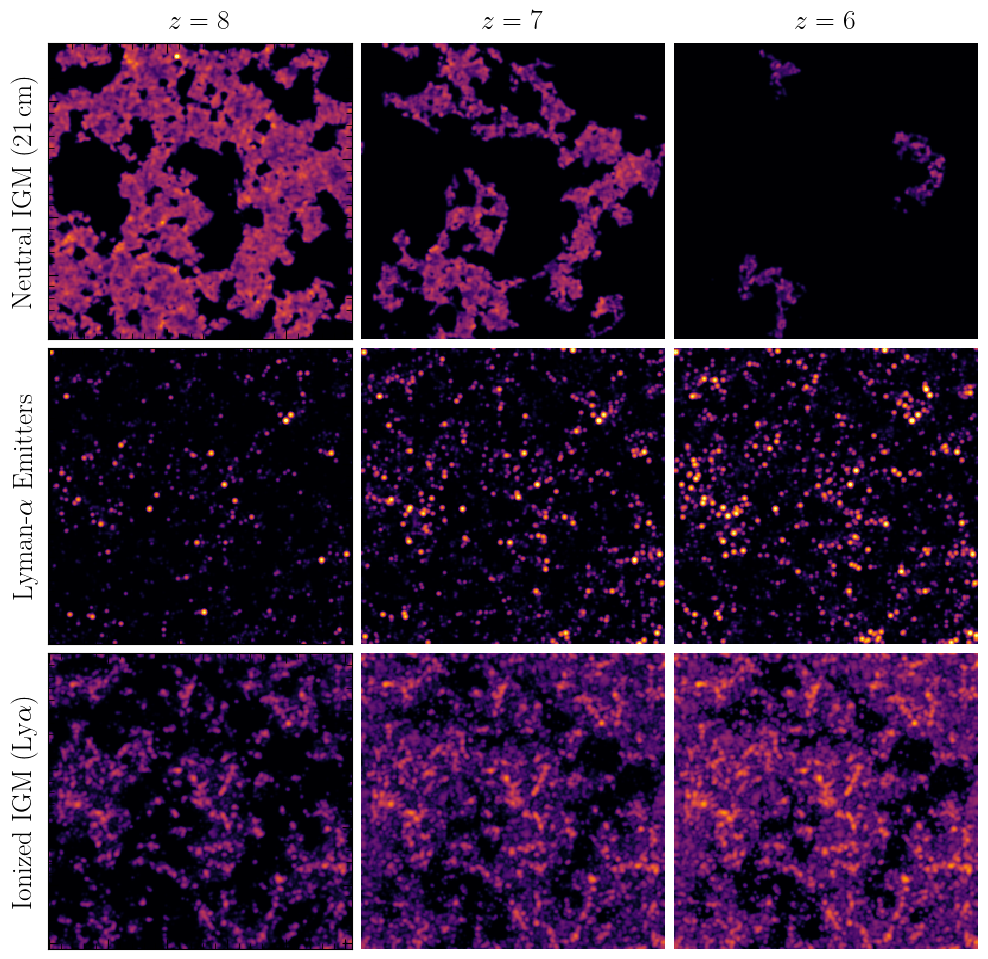

# SESE Astrophysics Senior Thesis

Scripts, notebooks, and documents related to my SESE Astrophysics Senior Thesis: Estimating the Feasibility of Detecting the 21cm-Lyα Cross-Power Spectrum using HERA and SPHEREx.

